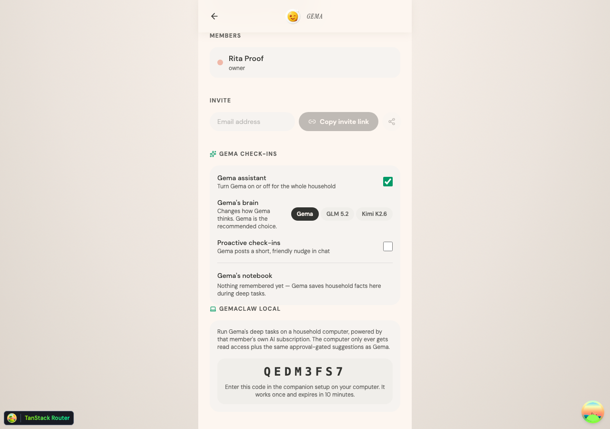
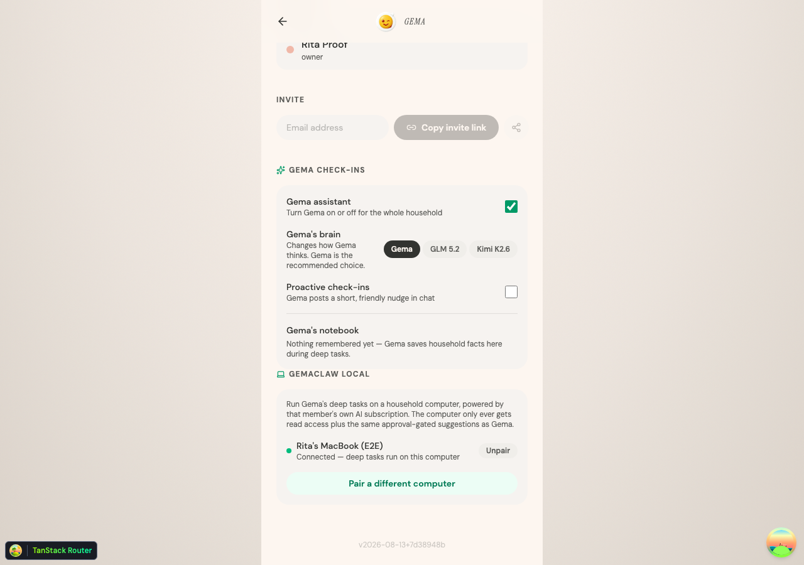
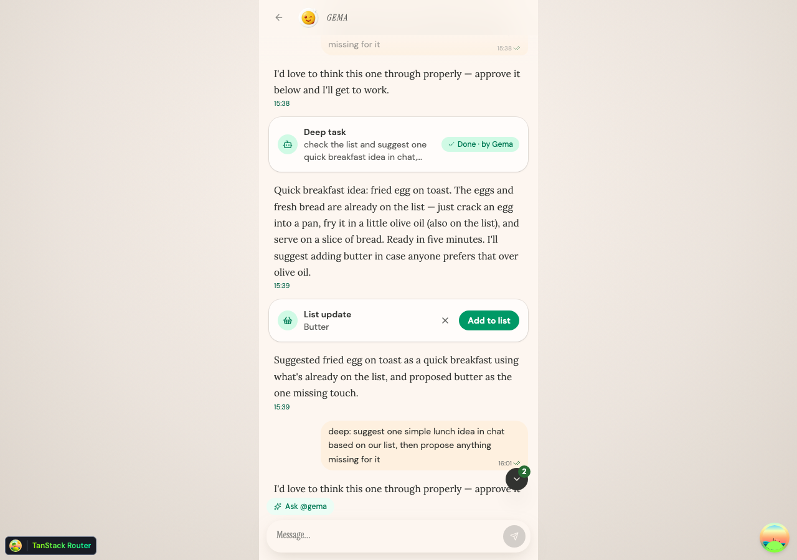
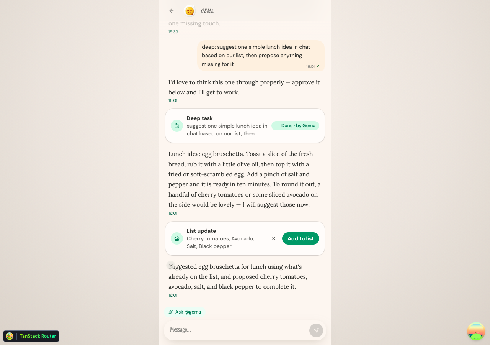
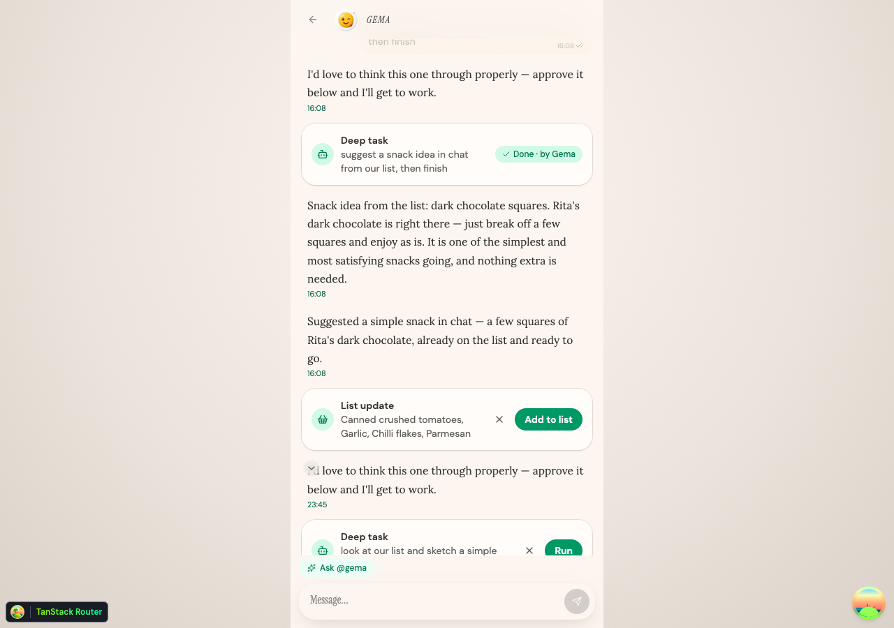
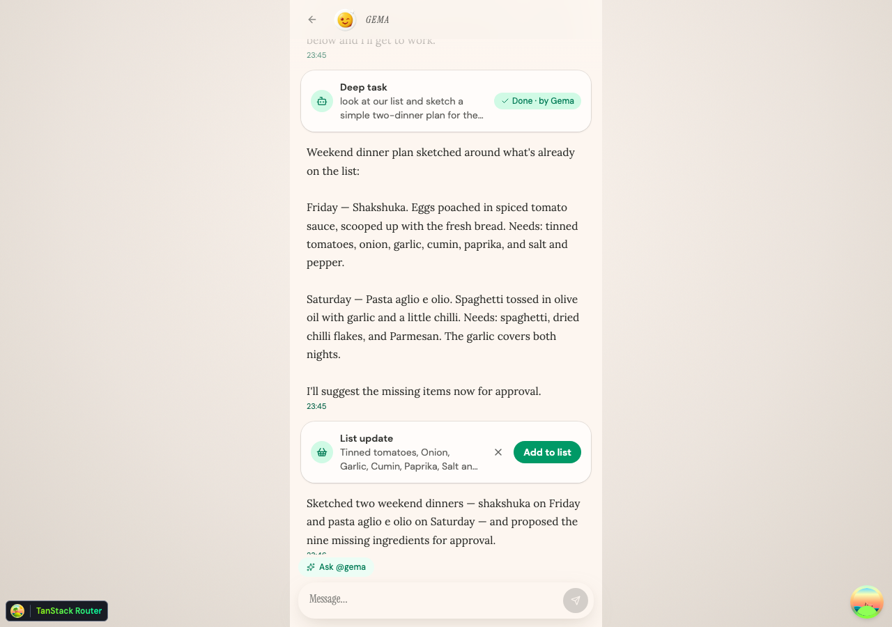

# GemaClaw Local — the complete guide

Run Gema's deep-thinking brain on **your own computer**, powered by **your own AI subscription** (Claude Code or Codex/ChatGPT), and talk to it from **Telegram**, **WhatsApp**, or the Gema app itself. This guide walks through every feature, start to finish. Every screenshot below is from a real run.

```
   You, anywhere                     Your computer                    Gema cloud
┌──────────────────┐          ┌──────────────────────────┐      ┌─────────────────┐
│ Telegram bot     │◄────────►│  GemaClaw Local companion │◄────►│ Gema server     │
│ WhatsApp (@gema) │          │  · your Claude/Codex login│      │ · household data│
│ Gema app (deep:) │          │  · runs the agent loop    │      │ · approval cards│
└──────────────────┘          └──────────────────────────┘      └─────────────────┘
```

**The safety deal, up front:** the companion can *read* your household (list, recent chat, its notebook) and *suggest* — every list change becomes an **approval card in the Gema app** that a human must accept. It cannot delete anything, cannot write the list directly, and the household owner can unpair it at any time. Your AI credential never leaves your machine.

---

## 1. Requirements

- A computer that stays on when you want Gema thinking (macOS/Linux, Node 20+).
- One agent subscription, signed in locally:
  - **Claude Code**: `npm i -g @anthropic-ai/claude-code`, run `claude`, sign in once. — or —
  - **Codex/ChatGPT**: `npm i -g @openai/codex`, run `codex login`.
- A Gema server with GemaClaw Local enabled (`GEMA_LOCAL_BRAIN=true`).
- Optional: a Telegram account and/or WhatsApp on your phone.

## 2. Install and pair (5 minutes)

**Step 1 — install:**

```bash
git clone https://github.com/Spectralgo/gemaclaw-local
cd gemaclaw-local
npm install
```

**Step 2 — get a pairing code.** In the Gema web app, open **Settings** (the `/household` screen) and scroll to the **GemaClaw Local** card. As the household owner, click **Pair a computer**. An 8-character code appears — it works once and expires in 10 minutes:



**Step 3 — run setup on your computer:**

```bash
npm run setup
```

It asks for: the Gema server URL, the pairing code, a name for this computer, which subscription runs the agent (Claude or Codex), and whether to connect Telegram and/or WhatsApp (both optional — sections 5–6).

**Step 4 — start the companion:**

```bash
npm start
```

Back in Gema's settings, the card now shows your computer as **Connected** with a green dot while the companion runs:



That's it. The companion polls Gema every few seconds for work. Stop it with Ctrl-C; deep tasks then simply fall back to Gema's cloud sandbox.

## 3. Deep tasks from the Gema app

In the household chat, ask Gema for something that deserves real thought, prefixed with `deep:`

> `deep: look at our shopping list and suggest three cosy dinner ideas, then propose any missing ingredients`

Gema files it as a **Deep task** card. Nothing runs until someone taps **Run**:



Once approved, your companion claims the task (within ~5 seconds) and works on it with your subscription's model — reading the list, thinking, posting its plan into the chat, and proposing groceries through a normal **List update** approval card. The task card flips to **Done · by Gema** when it finishes:



Typical run time: 15–45 seconds. If your computer is off or busy elsewhere, the task waits; if the companion never shows up, Gema's watchdog fails it visibly after 20 minutes (no card ever sticks on "Running…").

## 4. What Gema can do from a messenger

Both channels drive the same abilities:

| You say | Gema does |
|---|---|
| any question — *"what's on the list?"*, *"what could we cook tonight?"* | answers grounded in the live household data |
| *"add whatever's missing for shakshuka"* | proposes items → **approval card** in the app (never a direct write) |
| *"tick off the milk"* | proposes completions → approval card |
| *"tell the household I'll cook on Friday"* | posts a note to the household chat as Gema |
| `deep: plan the weekend meals` | files a **Deep task** card; after in-app approval your companion runs it **and reports the result back in the same chat** |

A real exchange from the proof run (Telegram):

> **You:** have a look at our list — what could we cook tonight?
>
> **Gema:** Looking at the list — eggs, fresh bread, and olive oil — a simple and satisfying option for tonight would be eggs in purgatory: fry a couple of eggs in olive oil with some canned tomatoes and spices, then mop it all up with the fresh bread. […]

And a proposal:

> **You:** please add whatever is missing for eggs in purgatory to our list
>
> **Gema:** I've proposed canned crushed tomatoes, garlic, chilli flakes, and Parmesan — the eggs, olive oil, and bread are already on the list. Approve the card in the app and you'll have everything you need.

The cards those messages created, as they appear in the app:



…and the Telegram-born deep task after the companion finished it:



## 5. Telegram (recommended)

Telegram gets a **dedicated bot**, so the chat is unambiguous — every message you send it is for Gema, no prefix needed.

1. In Telegram, message **@BotFather** → `/newbot` → pick a name (e.g. "Gema") and a username (e.g. `my_gema_bot`). BotFather replies with a **bot token** (`123456:ABC-…`).
2. Run `npm run setup` (or edit `~/.gemaclaw/config.json`) and paste the token when asked.
3. `npm start`, then open your bot in Telegram and say hi.

**Access control:** the **first person to message the bot claims it** — their Telegram user id is saved to the config allowlist automatically. Anyone else is silently ignored. To allow more household members, add their ids to `channels.telegram.allowFrom` in `~/.gemaclaw/config.json`.

No webhook, no public URL: the companion long-polls Telegram, so it works behind any home network.

## 6. WhatsApp

WhatsApp links the companion to **your own account** as a linked device — exactly like WhatsApp Web.

1. Enable WhatsApp during `npm run setup` (or set `channels.whatsapp.enabled: true`).
2. `npm start` — a QR code appears in the terminal:


3. On your phone: **WhatsApp → Settings → Linked devices → Link a device** → scan it. The session persists across restarts (stored in `~/.gemaclaw/whatsapp-auth`, private permissions).

**How to talk to Gema on WhatsApp:** open your **self-chat** ("Message yourself") and start the message with `@gema`:

> `@gema what's still open on the list?`
> `@gema deep: plan next week's dinners`

While Gema thinks you'll see a typing indicator; when a `deep:` task you filed finishes on this computer, its wrap-up arrives back in the same chat. (If your computer was offline when the task was approved, it runs in Gema's cloud and the result appears in the app instead.)

**Why the prefix?** This is your real account — Gema must never hijack a human conversation. Only messages starting with `@gema` / `gema:` / `deep:` get answered; everything else is ignored. Group chats are always ignored.

**Letting your partner in:** add their number to `channels.whatsapp.allowFrom` (e.g. `"+33612345678"`). Their WhatsApp DMs *to you* starting with `@gema` then get Gema replies (sent from your account — it reads as "Gema answering through your phone"). For a cleaner setup, give them their own Telegram bot access instead.

*Heads-up:* WhatsApp linking uses the same unofficial protocol as every WhatsApp bot library. For low-volume, prefix-gated household use this is the low-risk end, but it isn't officially sanctioned by Meta — Telegram is the worry-free choice.

## 7. Feature reference

| Feature | Where | Trigger |
|---|---|---|
| Household Q&A on your subscription | Telegram, WhatsApp | any message / `@gema …` |
| Grocery proposals (approval-gated) | all channels | ask naturally |
| Tick-off proposals (approval-gated) | all channels | ask naturally |
| Post a note to household chat | Telegram, WhatsApp | "tell the household…" |
| Deep tasks (multi-step, approval-gated) | app chat, Telegram, WhatsApp | `deep: …` |
| Web search during answers | everywhere | automatic when useful |
| Pair / unpair a computer | Gema app → Settings | owner only |
| Kill switch (pauses everything) | Gema app → Settings → "Gema assistant" | owner only |

## 8. Security model (short version)

- **Pairing** is a one-time owner-issued code; the companion keeps a token whose only powers are *poll, claim, bounded reads, and approval-gated suggestions*. Revoke it any time from settings.
- **Deep tasks** additionally use a per-task lease with a hard 40-call budget, valid only while the task is approved.
- **Writes**: list changes always go through approval cards. There is no delete, no expense write, no direct list write — by construction, on the server.
- **Your data**: task transcripts are written to `~/.gemaclaw/logs/` (private permissions) on your machine only.
- **Your AI credential** (Claude/Codex login) is used locally by the official SDKs and never sent to Gema.

## 9. Troubleshooting

First move, always: `npm run doctor` — it checks the config, your runtime login, the server + pairing, and each channel, and tells you exactly what to fix.


| Symptom | Fix |
|---|---|
| `npm start` says the token was rejected | Re-pair: Settings → GemaClaw Local → Pair a different computer, then `npm run setup`. |
| Settings dot is grey | The companion isn't running (or lost network). `npm start`. |
| Telegram bot ignores you | Someone else claimed it first — add your user id to `allowFrom`, or check the token. |
| WhatsApp asks for QR again | The device was unlinked from the phone; scan the fresh QR. |
| Deep task stuck on "Running…" | It fails visibly after 20 min. Check the companion terminal and `~/.gemaclaw/logs/<task>.jsonl`. |
| "Gema is disabled for this household" | The owner turned the master switch off in settings. |

## 10. Config reference (`~/.gemaclaw/config.json`)

```jsonc
{
  "serverUrl": "https://api.gema.example",   // your Gema server
  "companionToken": "…",                      // from pairing — treat as a password
  "runtime": "claude",                        // "claude" | "codex"
  "model": "claude-sonnet-4-6",              // optional override
  "channels": {
    "telegram": {
      "botToken": "123456:ABC-…",
      "allowFrom": ["777001"]                 // Telegram user ids; auto-filled on first contact
    },
    "whatsapp": {
      "enabled": true,
      "allowFrom": ["+33612345678"]           // numbers besides your self-chat
    }
  }
}
```

`GEMACLAW_HOME` relocates the whole config/state directory. Logs: `~/.gemaclaw/logs/`. WhatsApp session: `~/.gemaclaw/whatsapp-auth/`.
